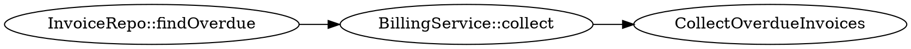

# 🧭 Call Chain Map

Bridge a **Query Map** to its **Entry Point(s)**. Start at a specific query, then trace upstream callers until you hit a public entry point or a reasonable stop condition.

---

## Query Reference

* **Query ID:** `[QM-001]`
* **Query Snippet:** `SELECT ... FROM invoices`
* **Location:** `app/Repos/InvoiceRepo.php:123`
* **Tables Hit:** `[invoices, users]`
* **Linked Docs:** Table Spec `[invoices.md]`, Query Map `[query-maps/invoices.md]`

---

## 1. Upstream Callers

| Depth | Caller Symbol              | File\:Line                           | Call Type       | Notes           | Confidence |
| ----: | -------------------------- | ------------------------------------ | --------------- | --------------- | ---------- |
|     0 | `InvoiceRepo::findOverdue` | `app/Repos/InvoiceRepo.php:110`      | direct          | Starting node   | high       |
|     1 | `BillingService::collect`  | `app/Services/BillingService.php:62` | method call     | Batch job       | medium     |
|     2 | `CollectOverdueInvoices`   | `app/Console/Commands/...:40`        | command handler | Artisan command | high       |

> Use one row per edge. Add more rows for fan out.

---

## 2. Entry Point Candidates

List the likely roots you reached or inferred.

* **HTTP Route:** `POST /billing/collect` → `BillingController@collect`
* **Console Command:** `php artisan billing:collect`
* **Queue Job:** `ProcessOverdueInvoices`
* **Event Listener:** `InvoiceOverdueListener`

---

## 3. Gaps and Dynamic Edges

Document places where static tracing breaks down.

* Reflection or dynamic method name building
* Indirect calls via container or event bus
* Calls through closures or array callables

For each gap, add a **hypothesis** and a **next step** to confirm.

---

## 4. Stop Conditions

Stop tracing when any of the following is true:

1. You hit a public entry point: route, command, job, listener, scheduled task.
2. Depth exceeds `[5]` without new information.
3. You enter framework or vendor code.
4. Confidence drops to low for two consecutive edges.

Record which condition you used.

---

## 5. Risk Notes

* N+1 risk upstream in `BillingController@collect`
* Missing transaction around multi table write
* Unbounded batch size in command

---

## 6. Mini Graph (optional)

Paste a small Graphviz snippet so readers can visualize the chain.

---

## 7. How to Reproduce

* HTTP: `curl -X POST https://example.test/billing/collect`
* CLI: `php artisan billing:collect`

---

### Field Guide - How to Trace Fast

**Search recipes**

* Linux or macOS: `rg -n "findOverdue\(|InvoiceRepo"`
* Windows PowerShell: `Select-String -Path .\ -Pattern "findOverdue\(|InvoiceRepo" -Recurse`

**Static helpers**

* Generate tags: `ctags -R .` then jump to callers in your editor
* PHP: run `phpstan` or `psalm` call graph plugins if available

**Laravel entry point hints**

* Routes: `routes/web.php`, `routes/api.php`
* Commands: `app/Console/Commands`
* Jobs: `app/Jobs`
* Events: `app/Events`, `app/Listeners`
* Schedules: `app/Console/Kernel.php`

---

👉 **In short:** Start from a query, walk callers upward, capture edges with confidence, stop sanely, and point to real entry points. This bridges Table Spec → Query Map → Entry Point without getting lost in the weeds.
